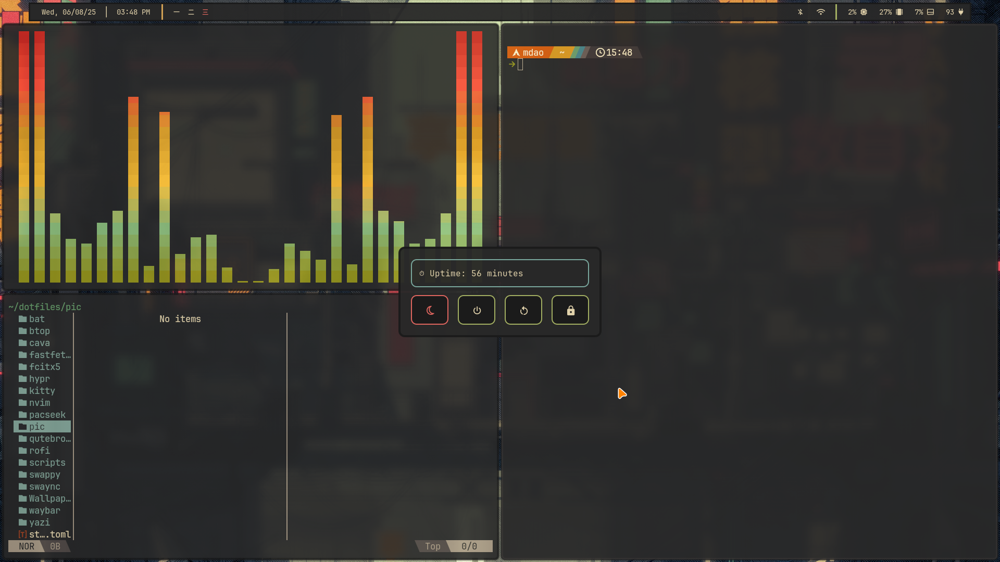

# 🏡 Gruvbox Hyprland Dotfiles

A warm, cozy Gruvbox-themed desktop setup powered by **Hyprland**, with consistent theming across GTK, Qt, terminal, bar, notifications, and text editor.

---

## 📸 Preview



---

## ✨ Components

| Component   | App                        | Theme/Notes                                                                            |
|-------------|----------------------------|-----------------------------------------------------------------------------------------|
| WM          | [Hyprland](https://github.com/hyprwm/Hyprland) | Tiling Wayland compositor                                                               |
| Terminal    | [Kitty](https://github.com/kovidgoyal/kitty)   | Gruvbox color scheme                                                                    |
| Bar         | [Waybar](https://github.com/Alexays/Waybar)    | Custom Gruvbox config                                                                   |
| Notifier    | [SwayNC](https://github.com/ErikReider/SwayNotificationCenter) | Themed to match Gruvbox                                                                |
| Text Editor | [Neovim](https://github.com/neovim/neovim)     | Gruvbox colorscheme (Lua config)                                                       |
| GTK Theme   | [Gruvbox-GTK-Theme](https://github.com/Fausto-Korpsvart/Gruvbox-GTK-Theme) | Applied via `lxappearance` or `gtk-settings`                                           |
| Qt Theme    | [`kvantum-theme-gruvbox-git`](https://aur.archlinux.org/packages/kvantum-theme-gruvbox-git) | Install from AUR, applied via Kvantum Manager                                          |

---

## 📦 Installation

> **Note:** Be sure to back up any existing configs before applying these dotfiles.

```bash
git clone https://github.com/the-daonm/hyprdotfiles.git
cd hyprdotfiles

# Copy config folders
cp -r hypr kitty waybar swaync nvim ~/.config/

# Apply GTK theme
git clone https://github.com/Fausto-Korpsvart/Gruvbox-GTK-Theme.git
cd Gruvbox-GTK-Theme
./install.sh

# Apply Qt theme
paru -S kvantum-theme-gruvbox-git
kvantummanager  # and choose the Gruvbox theme
