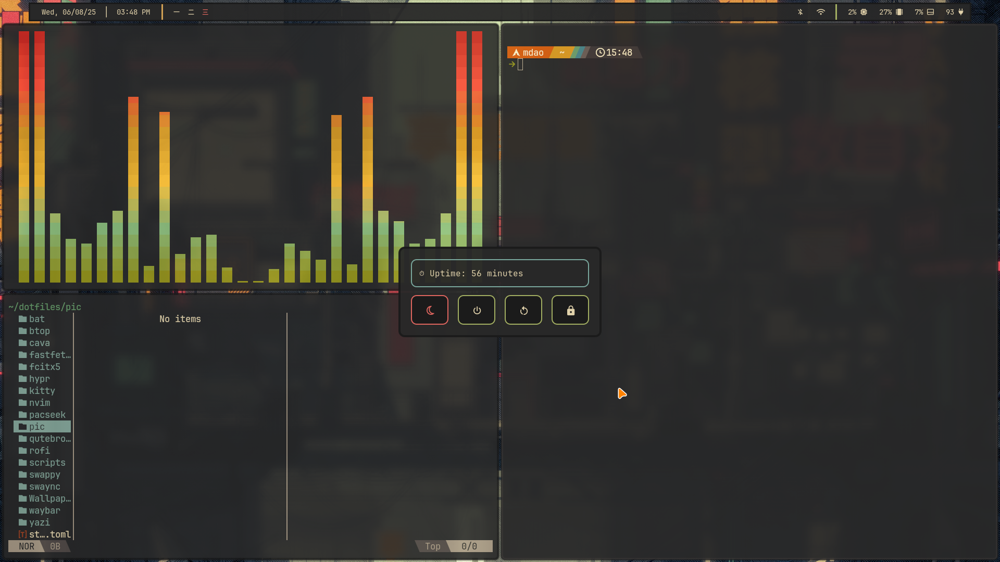

# 🏡 Gruvbox Hyprland Dotfiles

A warm, cozy Gruvbox-themed desktop setup powered by **Hyprland**, with consistent theming across GTK, Qt, terminal, bar, notifications, shell, and more.

---

## 📸 Preview



---

## ✨ Components

| Component       | App                        | Theme/Notes                                                                            |
|-----------------|----------------------------|----------------------------------------------------------------------------------------|
| Window Manager | [Hyprland](https://github.com/hyprwm/Hyprland) | Tiling Wayland compositor                                                               |
| Terminal       | [Kitty](https://github.com/kovidgoyal/kitty)   | Gruvbox color scheme                                                                    |
| Status Bar     | [Waybar](https://github.com/Alexays/Waybar)    | Custom Gruvbox configuration                                                            |
| Notifier       | [SwayNC](https://github.com/ErikReider/SwayNotificationCenter) | Gruvbox-themed notification center                                                      |
| Text Editor    | [Neovim](https://github.com/neovim/neovim)     | Gruvbox colorscheme with Lua-based configuration                                        |
| GTK Theme      | [Gruvbox-GTK-Theme](https://github.com/Fausto-Korpsvart/Gruvbox-GTK-Theme) | Applied via `lxappearance` or `gtk-settings`                                           |
| Qt Theme       | [kvantum-theme-gruvbox-git](https://aur.archlinux.org/packages/kvantum-theme-gruvbox-git) | AUR package, applied via Kvantum Manager                                                |
| Bluetooth      | [Blueman](https://github.com/blueman-project/blueman) | GTK-based Bluetooth manager                                                             |
| Network        | [nmtui](https://wiki.archlinux.org/title/NetworkManager#nmtui) | Text-based interface for NetworkManager                                                 |
| Shell          | [Zsh](https://www.zsh.org/) + plugins           | Fast, extensible shell (see `.zshrc`)                                                   |
| App Launcher   | [Rofi](https://github.com/davatorium/rofi)     | Gruvbox-themed launcher                                                                 |

---
## 📦 Installation

> **⚠️ Warning:** Back up your existing configuration files before proceeding, as copying these dotfiles may overwrite them.

1. **Clone the repository:**
   ```bash
   git clone https://github.com/the-daonm/hyprdotfiles.git
   cd hyprdotfiles
   ```

2. **Copy configuration files:**
   ```bash
   cp -r hypr kitty waybar swaync nvim rofi ~/.config/
   ```

3. **Install and apply the GTK theme:**
   ```bash
   git clone https://github.com/Fausto-Korpsvart/Gruvbox-GTK-Theme.git
   cd Gruvbox-GTK-Theme
   ./install.sh
   ```

4. **Install and apply the Qt theme:**
   ```bash
   paru -S kvantum-theme-gruvbox-git
   kvantummanager  # Select the Gruvbox theme in the Kvantum Manager GUI
   ```

5. **Install dependencies (Arch Linux example):**
   Ensure the following packages are installed:
   ```bash
   sudo pacman -S hyprland kitty waybar swaync neovim rofi blueman networkmanager
   ```

6. **Enable NetworkManager (if not already enabled):**
   ```bash
   sudo systemctl enable NetworkManager
   sudo systemctl start NetworkManager
   ```

7. **Optional: Configure Zsh plugins:**
   If using Zsh, install plugins like `zsh-autosuggestions` and `zsh-syntax-highlighting`:
   ```bash
   sudo pacman -S zsh zsh-autosuggestions zsh-syntax-highlighting
   ```

---

## 🙏 Thanks & Inspiration

- [Fausto-Korpsvart/Gruvbox-GTK-Theme](https://github.com/Fausto-Korpsvart/Gruvbox-GTK-Theme) – Beautiful GTK Gruvbox theme.
- [Andr3xDev/dotfiles](https://github.com/Andr3xDev/dotfiles/tree/trunk) – Huge inspiration for layout, structure, and theming ideas.
